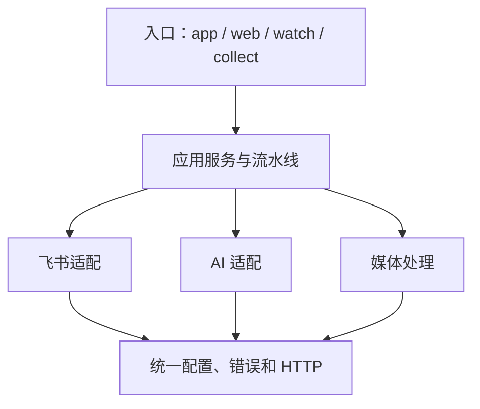

# 技术设计与配置参考

本文说明流光的内部边界和扩展方式。安装与日常操作请阅读项目 [README](../README.md)，所有默认配置以 [`.env.example`](../.env.example) 为准。

## 架构

系统是一个本地单体应用：飞书保存业务数据，Node.js 进程同时提供管理页面和任务监听器。内部按职责分层，不把供应商 API、任务状态和页面逻辑混在一起。



主要代码边界：

- `pipeline/` 控制元数据、媒体、转写和分析的阶段顺序，以及租约和失败聚合。
- `feishu/` 负责记录、字段、附件和首次建表，不向流水线泄漏 HTTP 细节。
- `ai/` 统一转写、校对、内容分析和模型降级。
- `media/` 管理候选地址、FFmpeg 和临时文件。
- `web/` 提供页面数据契约、应用服务、HTTP 路由和静态资源。
- `config/` 与 `core/` 提供环境配置、错误分类和网络重试。

入口只负责加载配置并启动用例。新增供应商时应实现适配边界，而不是在任务编排中增加供应商判断。

## 关键设计

### 飞书既是结果库，也是任务状态存储

一条作品对应一条飞书记录。作品信息、逐字稿、分析结果、当前阶段、执行 ID、租约和错误都写在同一条记录中，不按处理阶段拆表。

单表避免了跨表关联和分布式幂等成本。历史量明显增长后，更合适的做法是把较早完成的记录归档到历史表，而不是为每个处理步骤创建一张表。

初始化支持已有表格和自动建表两条路径。App Token 为空时，应用创建多维表格、重命名默认数据表、补齐字段，并将新 token 写回本机环境文件。

### 租约让中断后的任务可以恢复

监听器领取任务时写入执行 ID 和租约截止时间。有效租约阻止重复处理；租约过期后，其他轮询可以接管。临时网络、限流和服务端错误按指数退避，输入错误和缺少配置直接标记为不可重试。

每个阶段保留已完成结果。若进程在最后一次状态写入前中断，下一次轮询会补写完成状态，不重复调用已成功的模型。

### 媒体只读取一次

解析器保留多个视频候选地址，按码率和分辨率排序。下载、TLS 或音轨提取失败时自动换源；全部失效时只重新解析作品一次，避免无限循环。

FFmpeg 从同一输入流生成 32 kbps MP3 和可选归档视频。`none` 不产生归档文件；`feishu_compressed` 输出 720p H.264/AAC；`feishu` 使用无损复制兼容原视频模式。归档选择不影响 ASR 音频质量。

### 模型按质量和可用性降级

`ASR_MODE=fallback` 只在首选失败时调用下一个服务，避免同时消耗多家额度。`primary` 只用首选，`compare` 保留旧的多服务旁证行为。

OpenRouter 默认先调用 Whisper Large V3 Turbo。文本过短、长音频有效文本过少或异常重复时，质量门控会回退 Whisper Large V3。火山引擎和百炼可以替代 OpenRouter。

内容分析与转写解耦，只使用最终逐字稿中的事实，输出开头钩子、钩子类型、主题和核心知识点。主模型区域不可用、限流、网络失败或业务校验不通过时，按配置的备用模型链继续尝试。

### 页面轮询不等于重复渲染

页面每三秒获取轻量任务列表，只有选中的记录读取完整逐字稿和分析结果。前端比较数据签名，没有变化时只更新时间，不重建列表和详情，因此逐字稿搜索、标签选择和输入焦点不会被轮询打断。

视频始终使用飞书附件，不会以 Base64 或大文本写入表格。

## 配置

配置按“进程环境变量 → `ENV_FILE` → `.env.local` → 默认值”的顺序读取。页面只维护高频设置，完整能力仍由环境变量提供；旧环境文件和命令行入口保持兼容。

常用配置分为五组：

- 飞书与页面：`FEISHU_APP_ID`、`FEISHU_APP_SECRET`、`FEISHU_APP_TOKEN`、`FEISHU_TABLE_NAME`、`FEISHU_RECORD_CONCURRENCY`、`WEB_HOST`、`WEB_PORT`
- 媒体：`VIDEO_STORAGE_MODE`、`VIDEO_ARCHIVE_MAX_WIDTH`、`VIDEO_ARCHIVE_CRF`、`FFMPEG_PATH`
- 任务恢复：`PIPELINE_LEASE_SECONDS`、`PIPELINE_MAX_ATTEMPTS`、`PIPELINE_RETRY_BASE_SECONDS`、`PIPELINE_RETRY_MAX_SECONDS`
- 网络：`HTTP_TIMEOUT_MS`、`HTTP_MAX_RETRIES`、`AI_HTTP_TIMEOUT_MS`、`MEDIA_HTTP_TIMEOUT_MS`
- 模型：`AI_PROVIDER`、`ASR_MODE` 以及 `OPENROUTER_*`、`BAILIAN_*`、`VOLCENGINE_*`

GET、PUT 等幂等请求允许自动重试；POST 默认不重放，避免重复创建飞书记录或重复消耗模型额度。

页面保存密钥时写入权限为 `0600` 的环境文件。读取接口只返回“是否已配置”，不会把已有密钥发回浏览器。涉及监听器并发等启动期配置时，需要重启进程。

## Web 与安全边界

页面业务接口保持简单：`records/list` 返回轻量列表，`records/get` 返回单条完整详情，`records/create` 和 `records/retry` 修改任务；`settings/get`、`settings/save`、`settings/setup` 管理本机配置和飞书初始化。所有业务接口使用 POST，`GET /health` 用于本机健康检查。

默认监听 `127.0.0.1`，并设置 CSP、`X-Frame-Options: DENY`、`nosniff` 和 `no-referrer`。请求体限制为 64 KiB，静态文件做目录边界检查，页面内容在渲染前转义，外部链接只接受 HTTPS。

当前服务没有用户认证。不要直接把 `WEB_HOST` 改为公网地址；远程访问前必须增加认证、TLS、CSRF 防护、速率限制和访问审计。

业务数据保存在飞书，封面和可选视频保存在飞书云盘，密钥保存在本机环境文件。临时媒体在正常完成或失败后清理；浏览器只保存主题偏好。

## 运行、扩展与验证

统一入口 `npm start` 同时启动页面和监听器。`npm run web`、`npm run watch`、`npm run collect`、`npm run parse` 和 `npm run setup:fields` 用于单独运行相应能力。`deploy/macos/` 提供 LaunchAgent 模板。

扩展时遵守现有边界：

- 新 ASR 返回统一转写结构，并注册到服务选择和降级链。
- 新内容来源转换为标准作品元数据和媒体候选。
- 新存储在应用服务层实现数据接口，不进入任务状态模块。
- 新语言在 `src/web/public/locales/` 增加语言包。
- 页面继续保留入口控制器、仪表盘视图和通用 UI 三个边界，不为几十行逻辑单独拆文件。

提交前运行：

```bash
npm run check
npm test
```

测试不读取 `.env.local`，也不访问真实飞书、抖音或模型服务。它验证配置写入、自动建表、任务租约、媒体准备、模型降级和页面 API，但不能替代目标环境中的真实地址、权限、地区可用性和远程服务质量验收。
